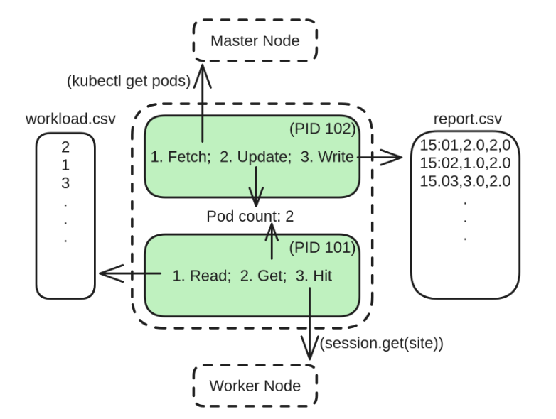
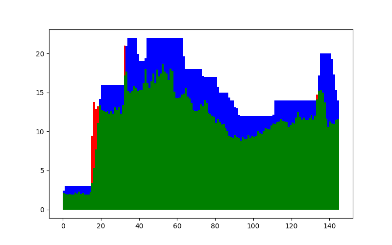
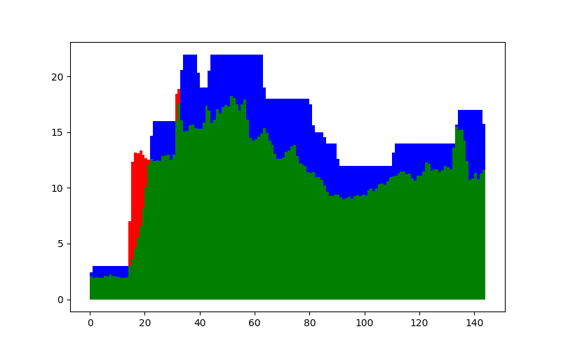
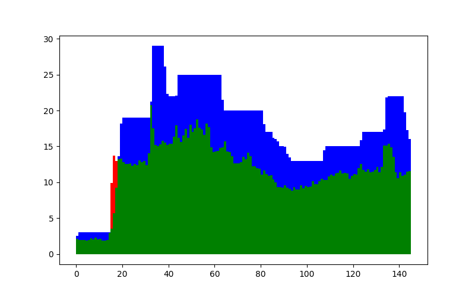
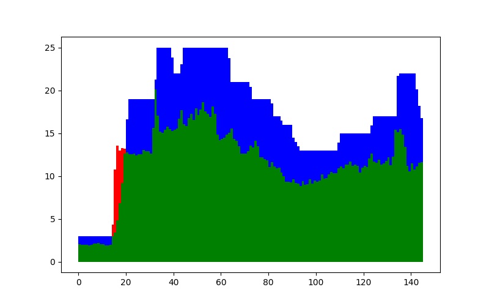
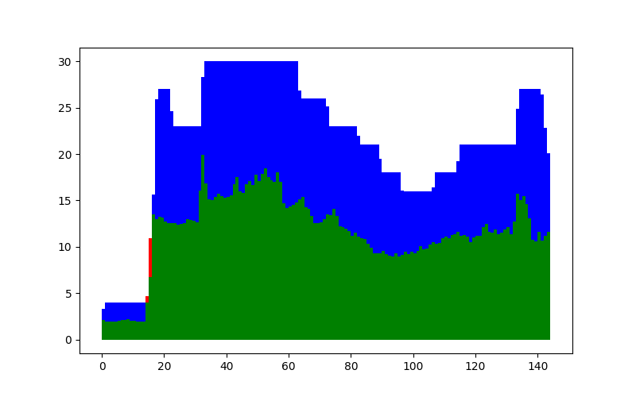
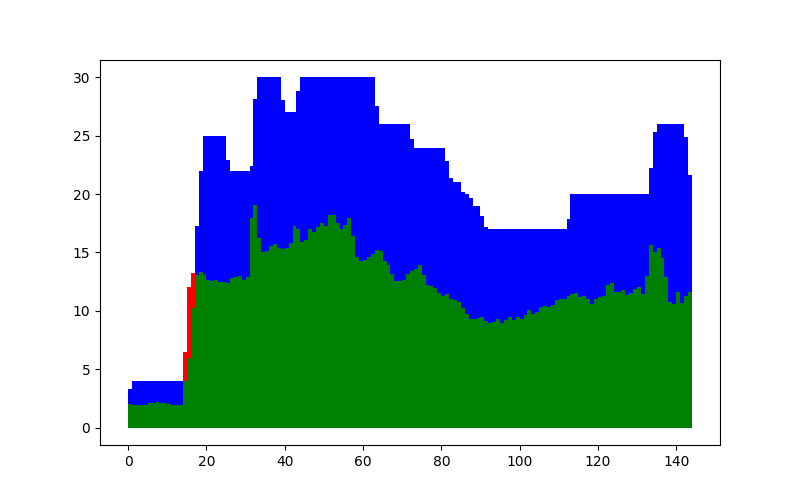
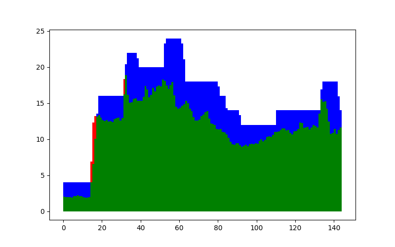
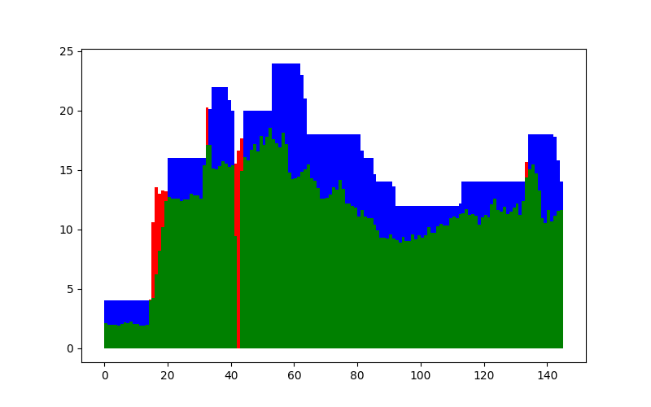
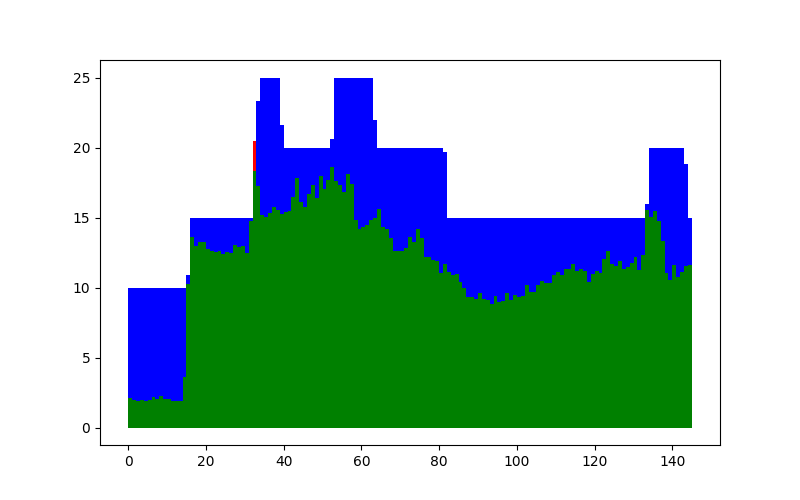

# Dokumentasi Hasil Pengujian

## 1. Perancangan Eksperimen
Eksperimen dirancang untuk menguji efek penggunaan CPU resource pada layanan Kubernetes terkelola (Google Kubernetes Engine - GKE) dibandingkan dengan pengelolaan Kubernetes mandiri (Google Compute Engine - GCE). Fokus utama eksperimen adalah:

- Efisiensi penggunaan CPU resource.
- Pengurangan degradasi performa CPU.
- Penghematan biaya CPU.

## 2. Topologi yang Diuji
Topologi eksperimen Kubernetes melibatkan komponen utama:

- Master Node:
  - Pada GKE, dikelola sepenuhnya oleh penyedia cloud (Google).
  - Pada GCE (pengelolaan mandiri), diatur dan dikonfigurasi secara manual menggunakan K3s.
- Worker Node:
  - Node tempat kontainer dijalankan.
  - Menggunakan spesifikasi mesin virtual n1-highcpu-32 (32 vCPU) dengan sistem operasi Container-Optimized OS untuk GKE dan Debian GNU/Linux 12 untuk GCE.

Diagram Topologi Kubernetes:
- GKE Mode:
    - Master node → Dikelola oleh Google.
    - Worker nodes → 1 hingga 3 node, digunakan untuk menjalankan pod.
- GCE Mode:
    - Master node → Dikelola pengguna dengan K3s.
    - Worker nodes → Sama dengan GKE, tetapi sepenuhnya diatur secara manual.


## 3. Skenario Eksperimen


Eksperimen dirancang dalam beberapa skenario untuk membandingkan performa dan biaya dengan variasi penggunaan resource:
| Scenario           | Min Replicas | Max Replicas | CPU Threshold (%) | CPU Requests (vCPU) | CPU Limits (vCPU) | Classification | Purpose                                          |
|--------------------|--------------|--------------|--------------------|----------------------|--------------------|----------------|--------------------------------------------------|
| Baseline           | 2            | 30           | 85                 | 1                    | 1                  | Guaranteed     | Baseline configuration with moderate scaling.    |
| Guaranteed 2vCPU   | 2            | 15           | 85                 | 2                    | 2                  | Guaranteed     | Higher guaranteed resources per Pod for heavier workloads. |
| Guaranteed 5vCPU   | 2            | 6            | 85                 | 5                    | 5                  | Guaranteed     | High computational tasks with minimal number of replicas. |
| Threshold 60% CPU  | 2            | 30           | 60                 | 1                    | 1                  | Guaranteed     | Aggressive scaling for variable workloads.       |
| Threshold 75% CPU  | 2            | 30           | 75                 | 1                    | 1                  | Guaranteed     | Balanced scaling for moderately fluctuating CPU needs. |


## 4. Implementasi Eksperimen


#### Program Klien:
#### cara kerja program test.py
- terdiri dari dua process yang berjalan secara paralel, yaitu process yang berinteraksi dengan master node dan process yang berinteraksi dengan worker node.
- Process yang berinteraksi dengan master node memeriksa jumlah pod yang tersedia dengan kubectl setiap detiknya.
- Setelah itu, process tersebut menulis laporan report.csv yang menyatakan bahwa pada detik tersebut, terdapat demand sebesar yang tertulis pada dataset workload.csv, dengan kapasitas aktual CPU sebesar jumlah pod dikalikan dengan ukuran pod. Informasi jumlah pod tersebut
juga dipakai oleh process yang berinteraksi dengan worker node.

workload.csv
  ```
  waktu,  jumlah_permintaan
  0,      2
  1,      1
  2,      3
  ```
Report.csv
  ```
Time,Desired,Actual
15:01:02,2
15:02:01,2
15:03:03,2
  ```
  

  #### cara kerja program analyze.py
  - Menganalisis data hasil pengujian dari test.py yang disimpan di report.csv.
  - Menghasilkan metrik CPU (digunakan, idle, degradasi) dan visualisasi grafik.


#### Konfigurasi Deployment:

- Cluster Deployment:
  - GKE: Deploy dengan mode Kubernetes terkelola.
  - GCE: Deploy menggunakan K3s untuk pengelolaan Kubernetes mandiri.
- Resource Monitoring:
  - Data diambil menggunakan kubectl untuk melihat ketersediaan dan penggunaan resource.

####  Parameter yang Diukur:

  - Utilisasi CPU :

    ```
        CPU_terpakai = min(CPU_diperlukan, CPU_tersedia)

        CPU_degradasi = max(CPU_diperlukan - CPU_tersedia, 0)

        CPU_idle = max(CPU_tersedia - CPU_diperlukan, 0)
    ```

  - Scaling Delay:
    - Waktu yang diperlukan untuk menambah replika pod ketika workload meningkat.
  - Biaya CPU:
    - Biaya dihitung berdasarkan penggunaan guaranteed dan shared resource serta kerugian akibat degradasi.


## 5. Hasil Eksperimen


<table>
  <tr>
    <th rowspan="2">Skenario</th>
    <th colspan="2">Layanan Terkelola (GKE)</th>
    <th colspan="2">Kelola Mandiri (GCE)</th>
  </tr>
  <tr>
    <th>Guaranteed</th>
    <th>Degradasi</th>
    <th>Guaranteed</th>
    <th>Degradasi</th>
  </tr>
  <tr>
    <td>Guaranteed 2vCPU</td>
    <td>2156</td>
    <td>52</td>
    <td>2201</td>
    <td>14</td>
  </tr>
  <tr>
    <td>Guaranteed 5vCPU</td>
    <td>2486</td>
    <td>2</td>
    <td>2467</td>
    <td>2</td>
  </tr>
  <tr>
    <td>Threshold 75%</td>
    <td>2458</td>
    <td>28</td>
    <td>2490</td>
    <td>18</td>
  </tr>
  <tr>
    <td>Threshold 60%</td>
    <td>3043</td>
    <td>12</td>
    <td>3103</td>
    <td>5</td>
  </tr>
  <tr>
    <td>Baseline</td>
    <td>2121</td>
    <td>47</td>
    <td>2173</td>
    <td>26</td>
  </tr>
</table>


## Grafik hasil pengujian

### Baseline GCE


### Baseline GKE


### Threshold 75% GCE


### Threshold 75% GKE


### Threshold 60% GCE


### Threshold 60% GKE


### Guaranteed 2vCPU GCE


### Guaranteed 2vCPU GKE


### Guaranteed 5vCPU GCE


### Guaranteed 5vCPU GKE

